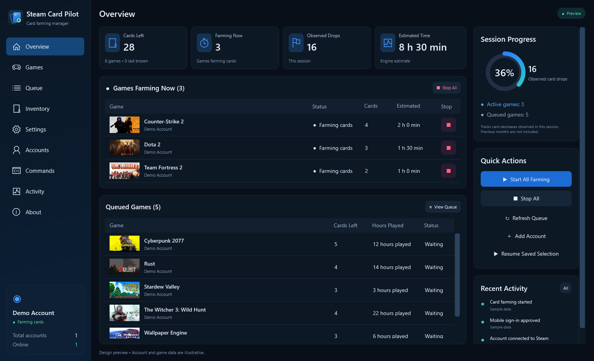
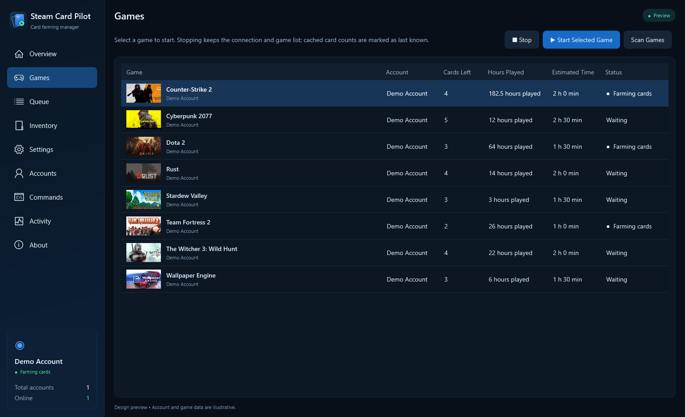

<p align="center">
  
</p>

<h1 align="center">Steam Card Pilot</h1>
<p align="center"><strong>Your accounts. Your games. Your next card.</strong><br />An open-source Windows desktop companion for Steam card farming.</p>
<p align="center">Windows x64 · .NET 10 · English UI · Apache-2.0<br />Created by <strong>Mr_Aec</strong> · Powered by ArchiSteamFarm</p>


<p align="center"><em>Design preview with synthetic account data. Game artwork is loaded from Steam; no personal account is shown.</em></p>

## What it does

Steam Card Pilot gives ArchiSteamFarm a native WPF interface with a dark navy palette, blue controls, and a card-inspired identity. Connect your accounts, inspect eligible games, and choose exactly where farming should run.

- **Choose one game.** Start Selected Game farms only that game on its associated account. It does not switch to another game when finished.
- **Keep your connection.** Stop Farming pauses farming without signing the account out of Steam.
- **Keep your list.** Known games and each account's selection survive closing and reopening the app. Cached entries are marked **Last known**.
- **Approve on your phone.** Steam mobile approval continues sign-in automatically. A code input appears only when Steam actually requests a code.
- **Use your existing Family View PIN.** Save your four-digit PIN locally; the desktop engine does not attempt automatic PIN recovery.
- **Manage several accounts.** Inspect status, pause all farming, resume saved selections, and use engine/plugin commands.
- **Inspect activity and inventory.** View engine logs and the selected account's Steam community inventory.

Steam determines card eligibility and drop timing. The Games screen contains games discovered for card farming, not the entire owned library. An installed or running Steam client is not required by the engine.

<details>
<summary><strong>See the selected-game controls</strong></summary>



Select a game, start that game only, and stop farming without losing the list or signing out. This screenshot also uses synthetic account data.

</details>

## Build and run

You need **Windows x64**, the **.NET 10 SDK**, and PowerShell. Clone or download the source, open PowerShell in the project folder, then run:

```powershell
./tools/publish-windows.ps1
./dist/SteamCardPilot/SteamCardPilot.exe
```

The default package includes its .NET runtimes. Keep the entire distribution folder together, including `engine` and the license files. Build output is ignored by Git.

For a smaller package that uses installed .NET 10 Desktop and ASP.NET Core runtimes:

```powershell
./tools/publish-windows.ps1 -FrameworkDependent
```

The desktop package includes ItemsMatcher, MobileAuthenticator, and Monitoring. SteamTokenDumper source is retained, but the plugin is excluded by default because its upstream service requires a valid build token. Developers who already have that token can use `-IncludeTokenDumper`.

## First account

1. Open **Accounts → Add Account**.
2. Choose a local account name and enter your Steam username and password.
3. Approve the sign-in request in the Steam mobile app, or enter a Steam Guard code if requested.
4. If Family View is enabled, provide your existing PIN.
5. Open **Games** and wait for the eligible-game scan. Use **Scan Games** to request a fresh scan for paused accounts.
6. Select a row and choose **Start Selected Game**. **Stop** keeps the connection open; **Resume** restores the saved selection.

Accounts connect when the desktop opens and wait for your farming choice. Closing the desktop shuts down its managed engine. Reopening reconnects using available local session data; saved selections are retained, and farming resumes when requested.

**Start All Farming** explicitly switches online accounts to farming all eligible games. **Resume Saved Selection** preserves each account's previous choice. All accounts must complete sign-in before bulk start/resume.

## Privacy and local storage

This source repository contains **no personal accounts, passwords, session databases, authenticators, or user logs**. Test fixtures and preview data are synthetic. Never put your own account files in the repository.

Runtime data stays in `%LOCALAPPDATA%\AutoPlaySteam`. This storage name is retained for compatibility with earlier Auto Play Steam versions; upgrading does not require moving your accounts.

- `config/`: local account configuration and engine session databases.
- `logs/`: local engine activity.
- `games.json`: cached game metadata.
- `selection.json`: the selected game for each account.
- `artwork/`: downloaded game thumbnails, reused when scrolling and reopening the app. Missing fixed-path images are resolved through Steam's current store metadata.

The new-account form sends a password to the engine for sign-in without writing it to the account JSON file. The engine may retain login/session data. Imported configuration files retain their existing password-storage preferences. Family View PINs are saved in local account configuration.

The desktop IPC endpoint binds only to `127.0.0.1` and uses a new random authentication secret and local port on each engine start. Steam connectivity and optional upstream plugins make their own network requests. Review plugin settings before enabling additional functionality.

Before sharing source, run:

```powershell
./tools/check-share.ps1
```

This checks the Git sharing set when a repository is initialized, or the source tree otherwise. It rejects runtime account/session files and obvious credential material. See [PRIVACY.md](PRIVACY.md) for the publishing checklist.

## Dashboard numbers

**Observed Drops** counts decreases seen for the same game while connected during this desktop session. It is not a monthly total. Clearing a queue, going offline, or removing a cached entry does not count as a drop.

The engine provides the total remaining-time estimate for active accounts. Individual rows use a rough 30-minutes-per-card estimate. Steam can take longer. **Last known** card counts are cached metadata and can differ from current Steam data until refreshed. Sorting a table changes its presentation, not the engine's farming order.

## Development

The desktop lives in `src/SteamCardPilot.Windows`, and its checks live in `tests/SteamCardPilot.Checks`. `src/engine` contains the ArchiSteamFarm engine, plugins, and engine tests. Upstream engine assembly names and copyright notices are preserved for plugin compatibility and attribution. `SteamCardPilot.slnx` is the main solution; the optional engine solution is in `src/engine/ArchiSteamFarm.slnx`.

```powershell
dotnet build SteamCardPilot.slnx -c Release
dotnet test src/engine/ArchiSteamFarm.Tests/ArchiSteamFarm.Tests.csproj -c Release
dotnet run --project tests/SteamCardPilot.Checks -c Release
dotnet run --project tests/SteamCardPilot.UiChecks -c Release
```

After publishing, run the local engine integration checks:

```powershell
dotnet run --project tests/SteamCardPilot.Checks -c Release -- dist/SteamCardPilot/engine
```

Integration checks use a temporary disabled account with fake credentials; they do not sign in to a real Steam account. They cover account creation, password handling, Family View PIN preservation, authenticated local IPC, and engine restart.

Generate a privacy-safe preview or rebuild the icon:

```powershell
./dist/SteamCardPilot/SteamCardPilot.exe --preview C:\Temp\overview.png --demo
./tools/create-app-icon.ps1
```

The icon generator creates a 1024px PNG and a Windows ICO containing 16, 24, 32, 48, 64, 128, and 256px variants. Preview mode does not start the engine or load your account configuration.

Read [CONTRIBUTING.md](CONTRIBUTING.md) before opening an issue or pull request. Never attach account configuration, authenticator files, unredacted logs, or screenshots containing credentials.

## Contribute

Everyone can [fork the repository](https://github.com/MrAec/SteamCardPilot/fork), commit improvements in their fork, and submit a pull request to `main`. Maintainers review and merge contributions. See the [contribution guide](CONTRIBUTING.md) for the full workflow, [report a bug or suggest a feature](https://github.com/MrAec/SteamCardPilot/issues/new/choose), or join [Discussions](https://github.com/MrAec/SteamCardPilot/discussions).

## License and credits

**Steam Card Pilot and Mr_Aec's original desktop additions are open source under Apache-2.0.** See [LICENSE.txt](LICENSE.txt), [NOTICE.txt](NOTICE.txt), and [LICENSE-Mr_Aec.txt](LICENSE-Mr_Aec.txt).

This project is derived from [ArchiSteamFarm](https://github.com/JustArchiNET/ArchiSteamFarm) 6.3.10.4, © 2015–2026 Łukasz “JustArchi” Domeradzki and contributors. Original copyright notices and dependency licenses are retained. Steam connectivity is provided by SteamKit2. This fork is not endorsed by the upstream authors or Valve. Steam is a trademark of Valve Corporation.
